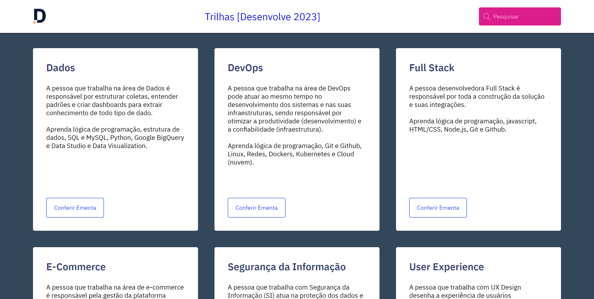

 

  <h1 id="top">Monitoria 01</h1>

  

    Página responsiva feita com HTML e CSS para absorver o conteúdo das aulas da
    plataforma <a href="https://cursos.alura.com.br/">Alura</a>.
  

  

    <a href="#desafio">Desafio</a>&nbsp;&nbsp;&nbsp;|&nbsp;&nbsp;&nbsp;
    <a href="#tecnologias">Tecnologias</a>&nbsp;&nbsp;&nbsp;|&nbsp;&nbsp;&nbsp;
    <a href="#projeto">Projeto</a>&nbsp;&nbsp;&nbsp;|&nbsp;&nbsp;&nbsp;
    <a href="#licenca">Licença</a>
  

  

    
  

   

  

    
  

 

<h2 id="desafio">🎯 Desafio</h2>

  ⚠️ Crie a MAIN e o FOOTER da página seguindo as instruções que se encontram no
  <a
    href="https://milenaemmert.notion.site/Desafio-Criando-o-Footer-da-p-gina-a87c70459fb942aba9b62cc952a17128"
    >Notion</a
  >

Compartilhe seus resultados com seus colegas!

Bons estudos! 😊💕

<h2 id="tecnologias">🚀 Tecnologias</h2>

Esse projeto foi desenvolvido com as seguintes tecnologias:

<ul>
  <li>HTML</li>
  <li>CSS</li>
</ul>

<h2 id="projeto">💻 Projeto</h2>

  <a
    href="https://barbaraishioka.github.io/desenvolve__gbtech__2023/projects/monitoria__01"
    >Visite o projeto online</a
  >

<h2 id="licenca">📝 Licença</h2>

Esse projeto está sob a licença MIT.

<h1></h1>

  Feito com ♥ by
  <a href="https://www.linkedin.com/in/barbaraishioka/">Bárbara Ishioka</a>

<a href="#top">⬆️ Voltar ao topo</a>

 
